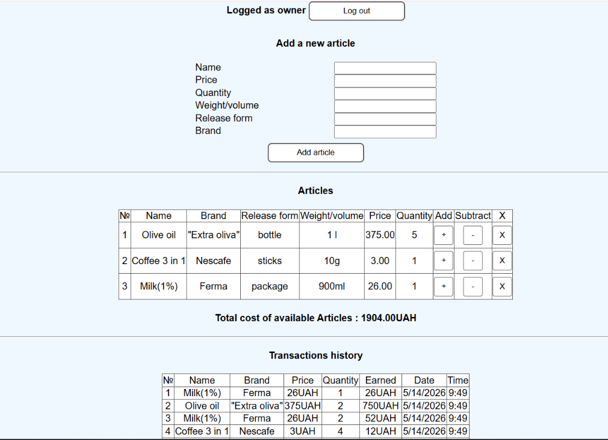

# 🛒 mstMarketplace — React Marketplace Application

A web application simulating a marketplace platform, developed for educational purposes to master Class Components in React and advanced state management with MobX. The project implements a two-role user model (Owner and Client), each featuring unique business logic and system privileges.

👉 **[Live Demo Application](https://OlehKuts.github.io./mstMarketplace)**

---

## 📷 Owner Dashboard Interface



---

## ✨ Features & Role Model

The application dynamically toggles available tools and interfaces based on the user's authentication status:

### 👤 Role: Client (Buyer)

- **Product Catalog:** Browse items, view real-time pricing, and check current stock availability.
- **Shopping Cart:** Add or remove products, manage quantities, and benefit from automatic total cost calculation.
- **Checkout System:** Finalize purchases with instantaneous inventory stock deduction.

### 👑 Role: Owner (Administrator)

- **Inventory Management:** Add brand-new products to the marketplace catalog or remove existing ones.
- **Supply Control:** Reorder and restock existing items to update warehouse levels.
- **Audit & Analytics:** Access a comprehensive ledger containing detailed transaction history and purchasing activity.

---

## 🛠️ Tech Stack

- **Core Library:** React (primarily **Class Components** to practice legacy architecture, component lifecycles, and class-based patterns).
- **State Management:**
  - `mobx` & `mobx-react` — for establishing a reactive, transparent, and declarative application state.
  - `mobx-state-tree` (MST) — for constructing a strongly-typed, tree-shaped transactional state model with built-in actions and runtime validation.
- **Data Validation:** `ajv` (utilizing JSON schemas to validate incoming data structures and objects securely).
- **Deployment:** GitHub Pages.

---

## 🚀 Local Installation and Setup

Follow these steps to run the project locally on your machine:

1. **Clone the repository:**

   ```bash
   git clone github.com
   ```

2. **Navigate to the project directory:**

   ```bash
   cd mstMarketplace
   ```

3. **Install dependencies:**

   ```bash
   npm install --legacy-peer-deps
   ```

   _(Note: The `--legacy-peer-deps` flag is recommended to prevent upstream toolchain dependency conflicts)._

4. **Start the local development server:**
   ```bash
   npm start
   ```
   _The application will automatically launch in your browser at [http://localhost:3000](http://localhost:3000)._

---

## 👤 Author

_Developed by [Oleh Kuts](https://github.com/OlehKuts)_
